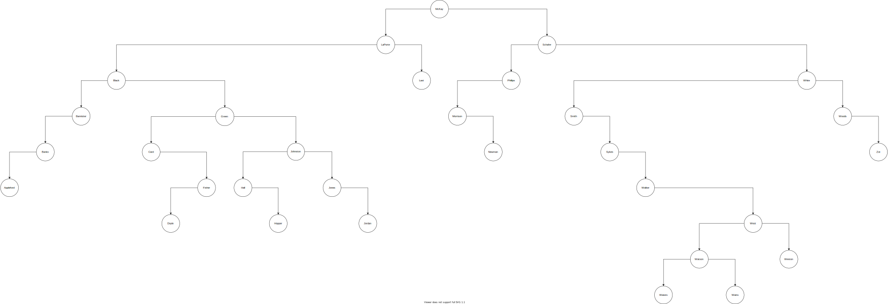
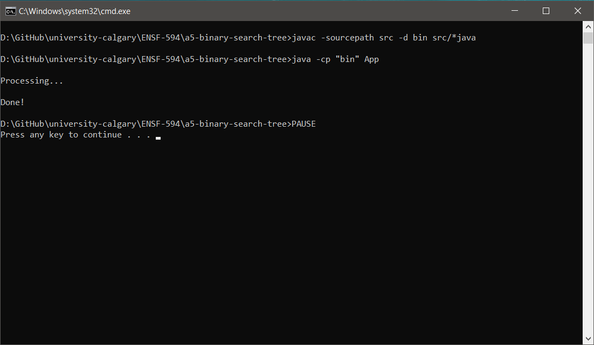

# ENSF-594 Assignment 5

An assignment on Binary Search Tree depth-first and breadth-first traversals.

## How to build and run

1. Clone the repository to your local machine.

2. Run the script [`launch.sh`](launch.sh) or [`launch.cmd`](launch.cmd) to launch the program.

## How it works

1. User launches the program

2. The program reads the [`input.txt`](input.txt) file

3. The program displays <b>Processing...</b> while it processes the input

4. The program writes the processed output in the files [`output1.txt`](output1.txt) and [`output2.txt`](output2.txt)

5. The program exits with the message <b>Done!</b>

## Tree Diagram

If the below diagram appears too much scaled down to view, then please click [here](https://raw.githubusercontent.com/meng-ucalgary/ensf-594-assignment-5/main/Images/diagram.svg).

## Execution Screenshots

